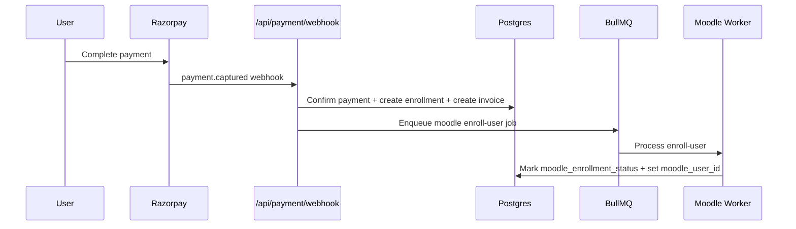
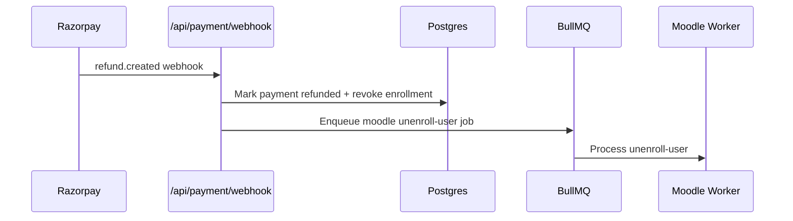

# NSTC Platform (`nanoshool-CMS-LMS`)

NSTC is a Next.js + Payload CMS + Postgres learning commerce platform with:
- Public catalog and product pages by domain (`ai`, `biotechnology`, `nanotechnology`)
- Role-based dashboards (`participant`, `mentor`, `program_manager`, `admin`)
- Paid and free enrollment paths
- Razorpay webhook-led payment confirmation
- Moodle sync via BullMQ queue workers
- Invoice generation and storage (S3/R2 with local fallback)
- Search APIs (keyword + semantic ranking)

## Tech Stack

- Frontend/App: Next.js 15, React 19, TypeScript
- CMS: Payload 3 (Postgres adapter)
- DB: PostgreSQL
- Queue: BullMQ + Redis
- Payments: Razorpay
- Email: Resend
- Search: Meilisearch + Postgres full-text semantic ranking
- Storage: S3 / Cloudflare R2

## Repository Structure

```text
app/                       # Next.js app router pages + API routes
components/                # UI components
lib/                       # DB, auth, search, queue internals
payload/                   # Payload collections/globals
services/                  # Business services (payment, enrollment, invoice, moodle, email)
scripts/                   # DB migrate + seed scripts
docs/architecture/         # Route constants and architecture helpers
```

## Local Setup

1. Install dependencies:

```bash
npm install
```

2. Copy env file and configure values:

```bash
cp .env.example .env
```

3. Run migrations:

```bash
npm run db:migrate
```

4. Seed default admin:

```bash
npm run db:seed
```

Default seed behavior:
- Admin email: `ADMIN_EMAIL` env value, or fallback `amit.rai@celnet.in`
- Admin password: `ADMIN_PASSWORD` env value, or fallback `password123`

5. Run app:

```bash
npm run dev
```

6. Run Moodle queue worker in a separate terminal:

```bash
npm run worker:moodle
```

## Runtime Commands

- `npm run dev` - start app in development
- `npm run build` - production build
- `npm run start` - start production server
- `npm run typecheck` - TypeScript checks
- `npm run lint` - lint checks
- `npm run db:migrate` - apply baseline SQL migration
- `npm run db:seed` - seed admin account
- `npm run worker:moodle` - start BullMQ Moodle sync worker

## Environment Variables

Use `.env.example` as source of truth. Critical keys:

- App/Auth: `NEXTAUTH_URL`, `NEXTAUTH_SECRET`, `PAYLOAD_SECRET`
- DB/Cache: `DATABASE_URL`, `REDIS_URL`
- Payments: `RAZORPAY_KEY_ID`, `RAZORPAY_KEY_SECRET`, `RAZORPAY_WEBHOOK_SECRET`
- Moodle: `MOODLE_BASE_URL`, `MOODLE_API_TOKEN`
- Storage: `S3_BUCKET`, `S3_REGION`, `S3_ACCESS_KEY_ID`, `S3_SECRET_ACCESS_KEY`, `S3_ENDPOINT`
- Search: `MEILISEARCH_HOST`, `MEILISEARCH_MASTER_KEY`
- Email: `RESEND_API_KEY`, `EMAIL_FROM`

Optional:
- `S3_PUBLIC_BASE_URL` for canonical public invoice URLs

## Product Flow Diagrams

### 1) High-Level Architecture

```mermaid
flowchart LR
  U[User Browser] --> N[Next.js App Router]
  N --> A[NextAuth]
  N --> P[(Postgres)]
  N --> R[(Redis)]
  N --> M[Meilisearch]
  N --> Z[Razorpay]
  Z --> W[/api/payment/webhook]
  W --> Q[BullMQ Queue]
  Q --> K[Moodle Worker]
  N --> S[S3/R2 Invoice Storage]
  N --> E[Resend Email]
```

### 2) Enrollment Entry Flow (Free vs Paid)

```mermaid
flowchart TD
  PD[Product Detail Page] --> CTA[Checkout Trigger]
  CTA --> CO[/api/payment/create-order]
  CO --> DEC{Final amount == 0?}
  DEC -->|Yes| FREE[Create paid=0 payment + enrollment + invoice]
  DEC -->|No| PAY[Create Razorpay order + pending payment]
  FREE --> RED1[Redirect to /dashboard/participant/enrollments]
  PAY --> RZP[Razorpay Checkout Modal]
  RZP --> RED2[Redirect to dashboard success state]
```

### 3) Paid Payment Confirmation (Webhook-Led)



### 4) Refund / Access Revoke Flow



### 5) Invoice Generation and Storage

```mermaid
flowchart TD
  ENR[Enrollment Created] --> INV[Generate PDF buffer]
  INV --> TRY[Store in S3/R2]
  TRY -->|Success| URL1[Public S3/R2 URL]
  TRY -->|Failure| LOC[Write to /public/invoices]
  LOC --> URL2[/invoices/{id}.pdf URL]
  URL1 --> UPD[Update invoices.pdf_url]
  URL2 --> UPD
```

### 6) Search and Indexing Flow

```mermaid
flowchart LR
  CMS[Payload Product Change] --> HK[Products hooks]
  HK --> IDX[indexProduct/removeProductFromIndex]
  IDX --> MEI[(Meilisearch)]
  UI[Search UI] --> API1[/api/search]
  UI --> API2[/api/search/global]
  UI --> API3[/api/search/semantic]
  API1 --> MEI
  API2 --> MEI
  API3 --> PGFTS[Postgres Full-Text Ranking]
```

## Role-Based Dashboards

- Participant:
  - `/dashboard/participant`
  - `/dashboard/participant/enrollments`
  - `/dashboard/participant/certificates`
  - `/dashboard/participant/invoices`
- Mentor:
  - `/dashboard/mentor`
  - `/dashboard/mentor/programs`
  - `/dashboard/mentor/students`
- Program Manager:
  - `/dashboard/program-manager`
  - `/dashboard/program-manager/cohorts`
  - `/dashboard/program-manager/progress`
- Admin:
  - `/dashboard/admin`
  - `/dashboard/admin/products`
  - `/dashboard/admin/users`
  - `/dashboard/admin/enrollments`
  - `/dashboard/admin/payments`
  - `/admin/collections/pages` (CMS page management)

CMS page publishing:
- Create a published page in Payload with `path` like `/about-us`
- The app automatically serves it on that URL via middleware rewrite to the CMS renderer

## Key API Endpoints

- Auth:
  - `GET /api/auth/me`
  - `POST /api/auth/signup`
  - `POST /api/auth/[...nextauth]`
- Enrollment/Checkout:
  - `GET|POST /api/enroll`
  - `POST /api/payment/create-order`
  - `GET /api/enrollments/user`
- Payments/Webhooks:
  - `POST /api/payment/webhook`
  - `POST /api/admin/refund`
- Search:
  - `GET /api/search`
  - `GET /api/search/global`
  - `GET /api/search/semantic`

## Troubleshooting

- Build shows Postgres connection warnings in restricted environments:
  - In sandboxed environments without DB socket access, static generation may log DB connection errors while build still completes.
- Moodle not syncing:
  - Ensure Redis is running and `npm run worker:moodle` is active.
- Invoice URL is local path instead of S3:
  - Check `S3_*` credentials and endpoint. Local file fallback is expected when upload fails.
- Free enrollment does not appear:
  - Verify product is `published` and final amount resolves to `0` after coupon/sale logic.

## Delivery Notes

- Wave 1, Wave 2, and Wave 3 implementation status is tracked in:
  - `CODE_VS_PRD_GAP_ANALYSIS_2026-04-23.md`
